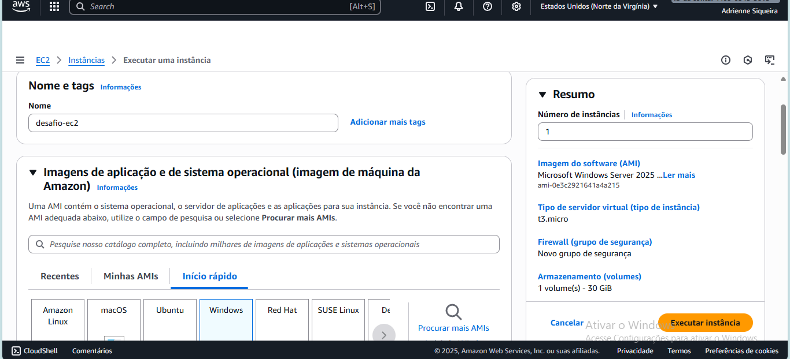

# ☁️ Desafio AWS – Gerenciamento de Instâncias EC2

Este repositório contém a documentação do **laboratório prático de AWS Cloud Foundations**, com foco no **gerenciamento de instâncias EC2**, criação e utilização de **AMIs (Amazon Machine Images)** e **Snapshots EBS**.  
O objetivo é consolidar os conhecimentos adquiridos no curso da DIO, demonstrando na prática como utilizar recursos essenciais da AWS.

---

## 🎯 Objetivos de Aprendizagem
- Criar e gerenciar **instâncias EC2** na AWS.  
- Anexar e utilizar volumes **EBS**.  
- Criar e utilizar **AMIs** para replicação de instâncias.  
- Criar e restaurar **Snapshots EBS**.  
- Documentar processos técnicos de forma clara em um repositório GitHub.    

---

## 📸 Evidências
As capturas de tela estão organizadas na pasta `/images`.  
Exemplo de referência no README:  

```markdown



